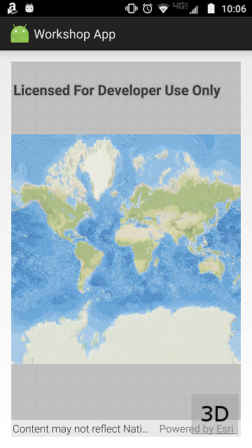
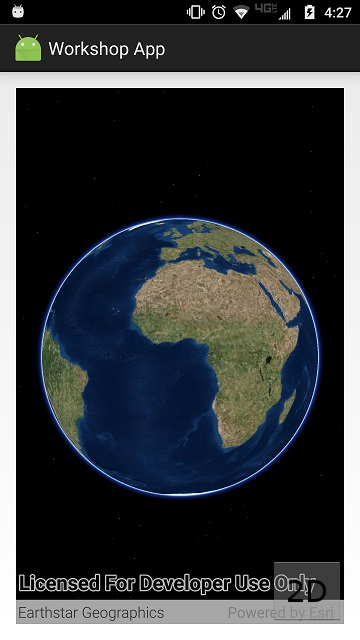

# Exercise 1: Map and Scene (Android)

This exercise walks you through the following:
- Create a new Android app
- Add ArcGIS Runtime to the app
- Add a 2D map to the app
- Add a 3D scene to the app, and use a toggle button to switch between 2D and 3D

Prerequisites:
- Install the Java Development Kit (JDK) version 6 or higher. Version 8 or higher is recommended.
- Install Android Studio. (You can build apps using the Android SDK Tools and a different IDE of your choice, but these exercises assume that you have installed Android Studio.)
- Enable developer mode on your Android 4.1 or higher device. You may also need to install USB drivers for your device. If you use an emulator instead of a physical device, you must [configure hardware acceleration](https://developer.android.com/studio/run/emulator-acceleration.html).

For more details on these prerequisites, see the [ArcGIS Runtime SDK for Android system requirements](https://developers.arcgis.com/android/latest/guide/system-requirements.htm).

If you need some help, you can refer to [the solution to this exercise](../../solutions/Android/Ex1_Map), available in this repository.

## Create a new Android app
1. Open Android Studio and start a new Android Studio project. Specify a minimum API level of 16 or higher, as required by ArcGIS Runtime Quartz. On the **Add an Activity to Mobile** screen, choose **Empty Activity** (not **Blank Activity** or **Add No Activity**). Call your activity `MainActivity`, ensure the **Generate Layout File** box is checked, and name the layout `activity_main`. For these exercises, it may be easier if you uncheck **Backwards Compatibility (AppCompat)**, but you should be able to complete the exercises either way. Click Finish, and an Android Studio project is created and opened.

1. Go to [the images directory](../../images) of this repository and copy all of the images to your Android Studio project's `res/drawable` directory. (Copying the images is easier if you clone this repo, or if you fork this repo and clone your fork.)

1. Under `app`, open `res/layout/activity_main.xml`. This XML file provides the layout for your app's main `Activity`. Look at the top-level XML element. Change its type to `RelativeLayout`. Typically this means you will replace `android.support.constraint.ConstraintLayout` with `RelativeLayout`, though it is possible that your Android Studio release will use a different type. Make this change at the start and end of `activity_main.xml`. _Note: ArcGIS components work well with `ConstraintLayout`, but since this exercise is about ArcGIS and not about Android layouts, we use the simpler `RelativeLayout`._

1. `res/layout/activity_main.xml` probably contains a `TextView` inside the `RelativeLayout`. Replace the `TextView` with a button for toggling between 2D and 3D. Use the 3D image for the button:

    ```
    <ImageButton
        android:id="@+id/imageButton_toggle2d3d"
        android:layout_width="wrap_content"
        android:layout_height="wrap_content"
        android:layout_alignParentRight="true"
        android:layout_alignParentBottom="true"
        android:src="@drawable/three_d"/>
    ```

1. Connect your Android device to your computer with a USB cable. In Android Studio, run your new app. Verify that a blank app runs, possibly with a default "Hello World" message inserted by Android Studio:

    
    
## Add ArcGIS Runtime to the app

1. In your Android Studio project, under **Gradle Scripts**, there are two files called `build.gradle`: one for the **project** and one for the **app module**. Open `build.gradle` for your project. Under `allprojects` > `repositories`, add a reference to the Esri Maven repository on Bintray. Make sure you do this under `allprojects` and not under `buildscript`:

    ```
    allprojects {
        repositories {
            jcenter()
            // Add the next three lines
            maven {
                url 'https://esri.bintray.com/arcgis'
            }
        }
    }
    ```
    
1. Open the `build.gradle` file for your app module. Under `dependencies`, add a reference to ArcGIS Runtime:

    ```
    dependencies {
        compile fileTree(dir: 'libs', include: ['*.jar'])
        androidTestCompile('com.android.support.test.espresso:espresso-core:2.2.2', {
            exclude group: 'com.android.support', module: 'support-annotations'
        })
        testCompile 'junit:junit:4.12'
        // Add the next line
        compile 'com.esri.arcgisruntime:arcgis-android:100.1.0'
    }
    ```
    
1. Choose **Tools** > **Android** > **Sync Project with Gradle Files** (or click the sync button on the toolbar). The ArcGIS Runtime libraries are downloaded automatically from the Maven repository.

## Add a 2D map to the app

1. Open `manifests/AndroidManifest.xml`. Inside the `<manifest>` element but not inside the `<application>` element, add the following elements to 1) request INTERNET permission and 2) require OpenGL:

    ```
    <uses-permission android:name="android.permission.INTERNET" />
    <uses-feature android:glEsVersion="0x00020000" android:required="true" />
    ```
    
1. In `AndroidManifest.xml`, add `android:configChanges="orientation|screenSize"` to the `<activity>` tag to stop the `Activity` from restarting when the device is rotated:

    ```
    <activity android:name=".MainActivity"
            android:configChanges="orientation|screenSize">
    ```

1. In `res/layout/activity_main.xml`, before the 2D/3D toggle button but inside the layout, add a `MapView` that fills the layout:

    ```
    <com.esri.arcgisruntime.mapping.view.MapView
        android:id="@+id/mapView"
        android:layout_width="fill_parent"
        android:layout_height="fill_parent"/>
    ```

1. Open your `MainActivity` class. In that class, declare a non-final `MapView` and set it to `null`. Also declare and instantiate a new `ArcGISMap`:

    ```
    private MapView mapView = null;
    private ArcGISMap map = new ArcGISMap();
    ```
    
1. In `onCreate(Bundle)`, after the call to `setContentView(int)`, get the `MapView`, set the `ArcGISMap`'s basemap, and set the `MapView`'s map:

    ```
    mapView = (MapView) findViewById(R.id.mapView);
    map.setBasemap(Basemap.createNationalGeographic());
    mapView.setMap(map);
    ```
    
1. In `MainActivity`, override `onResume()`, `onPause()`, and `onDestroy()`, and call `resume()`, `pause()`, and `dispose()` respectively on the `MapView`:

    ```
    @Override
    protected void onResume() {
        mapView.resume();
        super.onResume();
    }

    @Override
    protected void onPause() {
        mapView.pause();
        super.onPause();
    }

    @Override
    protected void onDestroy() {
        mapView.dispose();
        super.onDestroy();
    }
    ```
    
1. Run your app. Verify that a map displays:

    

## Add a 3D scene to the app, and use a toggle button to switch between 2D and 3D

Everyone loves 3D! To conclude this exercise, you will add a 3D scene to the app, as well as a button that lets the user toggle between seeing the 2D map and seeing the 3D scene.

1. In `res/layout/activity_main.xml`, wrap the `MapView` in a `LinearLayout`, which you will use to toggle between the `MapView` and a new `SceneView`. Add a `SceneView` to the `LinearLayout` and set its `layout_weight` to `1`. Set the `MapView`'s `layout_weight` to `0`. This has the effect of maximizing the `MapView` and hiding the `SceneView`. Here's what your XML should look like, in place of the `MapView` tag you previously had:

    ```
    <LinearLayout
        android:layout_width="match_parent"
        android:layout_height="match_parent"
        android:orientation="vertical">
        <com.esri.arcgisruntime.mapping.view.SceneView
            android:id="@+id/sceneView"
            android:layout_width="match_parent"
            android:layout_height="match_parent"
            android:layout_weight="1"/>
        <com.esri.arcgisruntime.mapping.view.MapView
            android:id="@+id/mapView"
            android:layout_width="match_parent"
            android:layout_height="match_parent"
            android:layout_weight="0"/>
    </LinearLayout>
    ```

1. Before your constructor, instantiate a constant for the URL of an elevation service:

    ```
    private static final String ELEVATION_IMAGE_SERVICE = 
            "http://elevation3d.arcgis.com/arcgis/rest/services/WorldElevation3D/Terrain3D/ImageServer";
    ```
    
1. Before your constructor, declare a `SceneView` field and instantiate an `ArcGISScene`. Declare an `ImageButton` field for the 2D/3D toggle button. Instantiate a `boolean` field to keep track of whether the app is currently displaying 3D or not:

    ```
    private SceneView sceneView = null;
    private ArcGISScene scene = new ArcGISScene();
    private ImageButton imageButton_toggle2d3d = null;
    private boolean threeD = false;
    ```
    
1. In your constructor, get the `MapView`, set the `Scene`'s basemap, set the `SceneView`'s `Scene`, and set the `Scene`'s elevation source:

    ```
    sceneView = findViewById(R.id.sceneView);
    scene.setBasemap(Basemap.createImagery());
    sceneView.setScene(scene);
    scene.getBaseSurface().getElevationSources().add(new ArcGISTiledElevationSource(ELEVATION_IMAGE_SERVICE));
    ```
    
1. In `MainActivity`, in `onResume()`, `onPause()`, and `onDestroy()`, call `resume()`, `pause()`, and `dispose()` respectively on the `SceneView`, just as you did on the `MapView` already.
    
1. Declare a `public void` method with a `View` parameter to be called when the 2D/3D toggle button is clicked. Inside this method, change the value of the `threeD` field, set the value of `imageButton_toggle2d3d` if it has not been set, and change the button's image:

    ```
    public void imageButton_toggle2d3d_onClick(View view) {
        threeD = !threeD;
        if (null == imageButton_toggle2d3d) {
            imageButton_toggle2d3d = findViewById(R.id.imageButton_toggle2d3d);
        }
        imageButton_toggle2d3d.setImageResource(threeD ? R.drawable.two_d : R.drawable.three_d);
    }
    ```

1. In `res/layout/activity_main.xml`, in the `ImageButton` for toggling between 2D and 3D, add an `onClick` handler that calls the method you wrote in the previous step:

    ```
    android:onClick="imageButton_toggle2d3d_onClick"
    ```
    
1. Compile and run your app. Verify that clicking the button changes its image (or text).

1. To toggle between the 2D map and the 3D scene, you will call `setWeight` on the `MapView` and `SceneView`. If the `MapView` has a weight of `1` and the `SceneView` has a weight of `0`, only the `SceneView` will display. Setting the weight takes a few lines of code, so create a method to do it for you:

    ```
    // Note: this will only have an effect when the parent View is of type LinearLayout.
    private void setWeight(View view, float weight) {
        final ViewGroup.LayoutParams params = view.getLayoutParams();
        if (params instanceof LinearLayout.LayoutParams) {
            ((LinearLayout.LayoutParams) params).weight = weight;
        }
        view.setLayoutParams(params);
    }
    ```
    
1. In your event handler method for the 2D/3D toggle button, after changing the value of the `threeD` field, set the weight of `mapView` and `sceneView` according to the value of `threeD`:

    ```
    setWeight(mapView, threeD ? 1f : 0f);
    setWeight(sceneView, threeD ? 0f : 1f);
    ```
    
1. Compile and run your app. Verify that tapping the button changes its image (or text) and also toggles between 2D and 3D:
    
    
    
## How did it go?

If you have trouble, **refer to the solution code**, which is linked near the beginning of this exercise. You can also **submit an issue** in this repo to ask a question or report a problem. If you are participating live with Esri presenters, feel free to **ask a question** of the presenters.

If you completed the exercise, congratulations! You learned how to add a map to an app, using ArcGIS Runtime.

Ready for more? Start on [**Exercise 2: Add Zoom In and Zoom Out Buttons**](Exercise%202%20Zoom%20Buttons.md).
